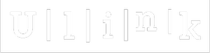

<div align="center">
  
  # Ulink
  
  <a href="https://github.com/ImGabe/ulink-backend">
    
  </a>

  <p align="center">Url shortener to reduce a long link write in Rust.</p>
  
  [![Forks][forks-shield]][forks-url]
[![Stargazers][stars-shield]][stars-url]
[![Issues][issues-shield]][issues-url]
[![MIT License][license-shield]][license-url]
  
</div>

### Adjustments and enhancements

The project is still under development and the next updates will focus on the following tasks:

- [ ] Save urls in localStorage
- [ ] Implement Register/Login
- [ ] Implement custom Urls

## 💻 Pre-requisites

Before you begin, check that you have met the following requirements:

* Have `Rust/Docker/docker-compose`
* You have a machine with `<Windows / Linux / Mac>`.

## 🚀 Installing Ulink

To install the Ulink, follow these steps:

NixOs
```
nix develop
docker-compose up
cargo run
```

Linux e macOS:
```
docker-compose up
cargo run
```

## 📫 Contributing to Ulink

To contribute to Ulink, follow these steps:

1. Fork this repository.
2. Create a branch: `git checkout -b <branch_name>`.
3. Make your changes and commit them: `git commit -m '<commit_message>'`
4. Send to the original branch: `git push origin <branch_name> / <location>`
5. Create the pull request.

Alternatively, see the GitHub documentation on [how to create a pull request](https://help.github.com/en/github/collaborating-with-issues-and-pull-requests/creating-a-pull-request).

<!-- MARKDOWN LINKS & IMAGES -->
<!-- https://www.markdownguide.org/basic-syntax/#reference-style-links -->
[forks-shield]: https://img.shields.io/github/forks/ImGabe/ulink-backend
[forks-url]: https://github.com/ImGabe/ulink-backend/network/members

[stars-shield]: https://img.shields.io/github/stars/ImGabe/ulink-backend
[stars-url]: https://github.com/ImGabe/ulink-backend/stargazers

[issues-shield]: https://img.shields.io/github/issues/ImGabe/ulink-backend
[issues-url]: https://github.com/ImGabe/ulink-backend/issues

[license-shield]: https://img.shields.io/github/license/ImGabe/ulink-backend
[license-url]: https://github.com/ImGabe/ulink-backend/blob/master/LICENSE
